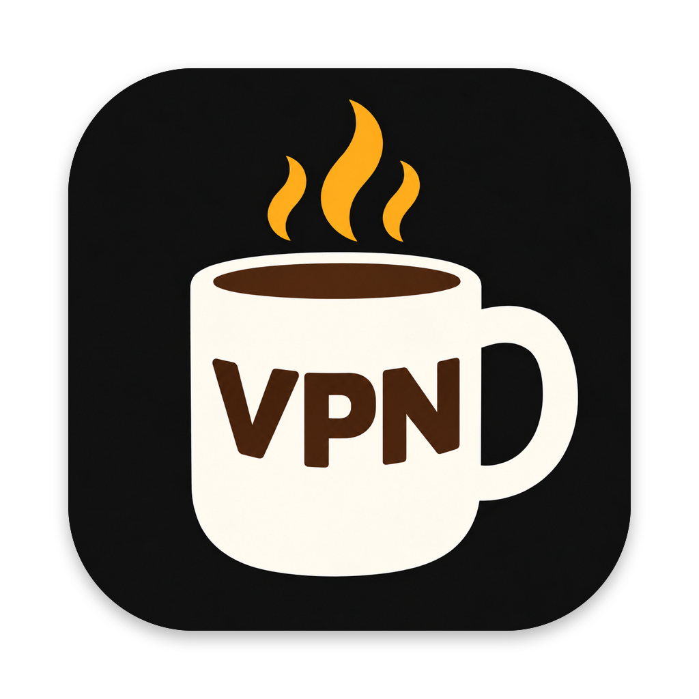
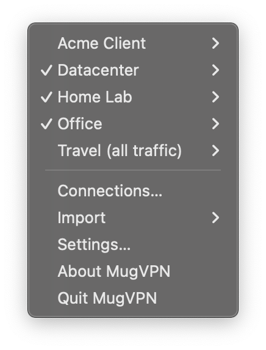
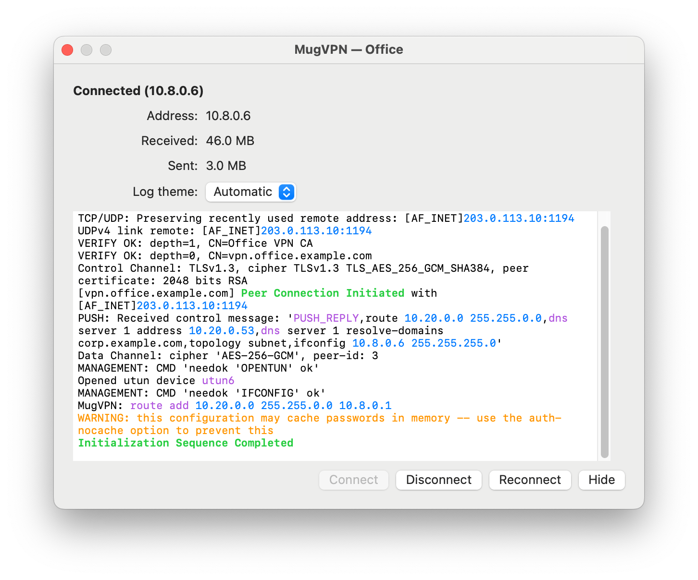
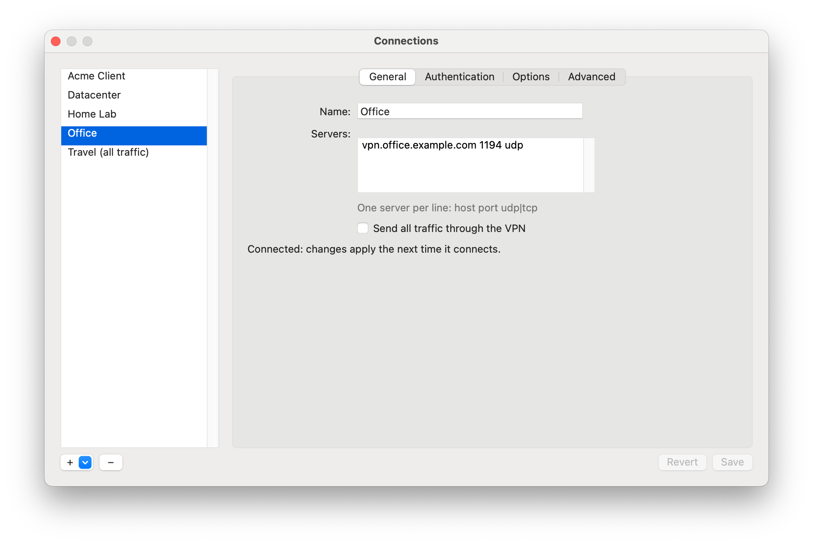
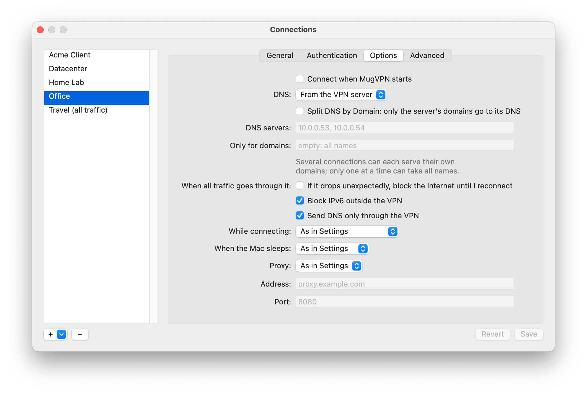
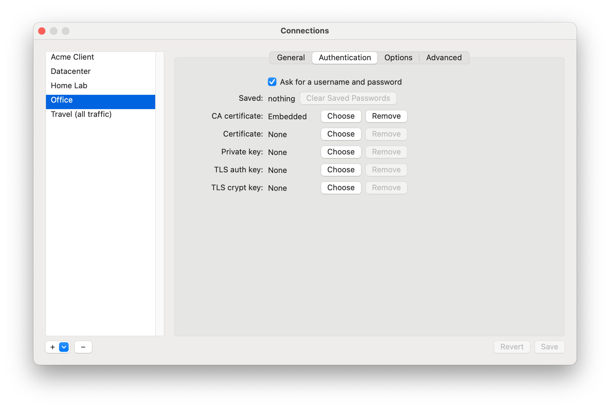
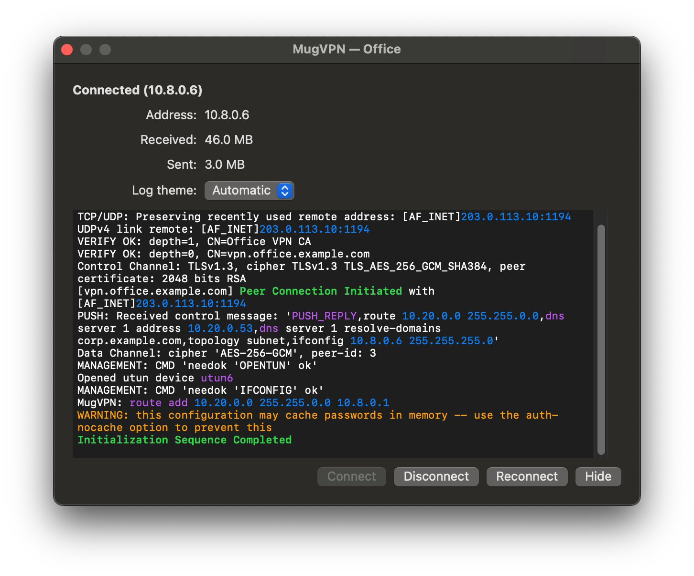

<p align="center"></p>

<h1 align="center">MugVPN</h1>

<p align="center"><b>A free macOS menu-bar client for OpenVPN profiles that keeps several VPN connections up at the same time.</b></p>

[](https://github.com/tanderbold/MugVPN/actions/workflows/macos.yml)
[](LICENSE)
[](#requirements)
[](#requirements)
[](#how-it-works)
[](#what-you-get)
[](Sources)

The office VPN, a client's VPN and your home lab — at the same time, each with its own tunnel,
routes and DNS. MugVPN sits in the menu bar; every `.ovpn` profile gets its own submenu, and a
Connections window creates, edits, imports and removes them. Under the hood each connection runs
its own `openvpn` 2.7, which runs without root: a small helper checks every profile and every route and DNS change it asks for.

<p align="center"> </p>

## What you get

**Several connections at once**
- Every connection has its own `utun`, routes and DNS; connect, disconnect and reconnect each on its own.
- **Split DNS per connection**: names in the domains a server pushes go to that tunnel's DNS, everything else as before — so two VPNs can each answer for their own domains. For servers that push only `dhcp-option DOMAIN`, one switch makes those domains split too.
- **Your own DNS for a connection**: its servers for the domains you list (or for all names), or leave the Mac's DNS alone.
- Warnings when connections collide: two that both take all traffic, overlapping routes, DNS already taken.

**Connections window**
- Create a connection from scratch — servers, ports, protocols, CA, certificate, key, `tls-auth`/`tls-crypt`, password sign-in — or edit any profile in a form or as text. Only the lines you change are rewritten.
- Import `.ovpn` files (with the keys they name), Tunnelblick `.tblk` folders, profiles from a URL or an OpenVPN Access Server; duplicate, rename, delete.
- Per connection: connect at launch, its own proxy, connect silently, what to do when the Mac sleeps.

<p> </p>

**Protection**
- **Kill switch**: if a connection that carries all traffic drops unexpectedly, the Mac's Internet stays blocked (PF) until you reconnect or unblock it from the menu — even across a restart of the helper.
- **Leak protection** while a connection carries all traffic: no IPv6 and no DNS outside the VPN; the local network can be allowed.
- **Leak check** after connecting and on every network change: warns if the default route, a public network (as a rogue DHCP server would push — TunnelVision) or the DNS goes around the tunnel.

**Signing in**
- Username and password, private-key passwords, static and dynamic challenges (OTP), web/SSO sign-in, PKCS#12 certificates, HTTP proxies. Passwords are kept in your login Keychain, per connection.

**Everyday**
- Coloured live log with a light/dark switch, View Log in Console; notifications.
- Reconnects at once after sleep and on network changes; optional disconnect on sleep.
- Persistent connections that an administrator puts in `config-auto` start at boot, before anyone logs in.
- Your own scripts beside a profile (`<name>_pre.sh`, `_up.sh`, `_down.sh`) — run as you, never as root.
- Command line: `MugVPN --command connect|disconnect|reconnect <profile>` and more.
- 23 languages, VoiceOver labels, light and dark appearance, a complete uninstaller.

<p> </p>

## Security

- **openvpn runs without root.** Each tunnel's `openvpn` runs unprivileged; a small helper does
  what needs root, after checking each request.
- **Profiles are checked** before they run: options that would run programs or load code are
  refused, with the line that caused it.
- **Passwords** stay in your login Keychain, per connection.
- Built test-first, with integration tests in virtual machines against real OpenVPN servers, and
  reviewed in repeated security audits.

Found a security problem? Please report it privately through
[GitHub's security advisories](https://github.com/tanderbold/MugVPN/security/advisories/new) rather than an issue.

## Requirements

macOS 13 Ventura or later, Apple silicon or Intel.

## Install

There is no signed release yet: MugVPN is waiting for an Apple Developer ID, and a root helper
from an unsigned build is not something to install from a download. Build it from source (below),
copy `build/MugVPN.app` to `/Applications` and open it. The first time you connect, macOS asks you to
allow MugVPN's helper in **System Settings > General > Login Items**; MugVPN opens that page for you.

## Profiles

| Where | What |
|---|---|
| `~/Library/Application Support/MugVPN/config` | your profiles (Import puts them here, one folder each) |
| `/Library/Application Support/MugVPN/config` | profiles an administrator installs for every user |
| `/Library/Application Support/MugVPN/config-auto` | persistent profiles, started by the system at boot |

Standard `.ovpn` profiles work as they are. For safety, a profile from a user may not
run programs as root: `up`, `down`, `plugin`, `script-security 2` and the like are refused, with
the line that caused it. Use the `_pre/_up/_down.sh` scripts instead; they run as you.

## Command line

```
MugVPN --connect <profile>
MugVPN --command connect|disconnect|reconnect <profile>
MugVPN --command disconnect_all | rescan | exit
MugVPN --command silent_connection 0|1
MugVPN --command import <path>
MugVPN --uninstall [--keep-profiles] [--yes]
```

`MugVPN` here is `/Applications/MugVPN.app/Contents/MacOS/MugVPN`.

## Uninstall

**About MugVPN > Uninstall MugVPN…**, or `MugVPN --uninstall --yes` in Terminal. It disconnects
every tunnel and removes the helper, its files and logs, your settings and saved passwords, and
moves the app to the Trash. *Keep my profiles* (`--keep-profiles`) leaves the profiles in place.

## How it works

- **MugVPN.app** (your rights): the menu, the windows, your profiles and saved passwords. It talks
  to each `openvpn` over its management interface.
- **The helper** (a LaunchDaemon): starts and stops `openvpn` for the app, sets up the tunnels it
  asks for and cleans up after a tunnel that ended.
- **openvpn 2.7**, built from source with OpenSSL 3.5, LZ4 and LZO, inside the app.

## Building

Only the Xcode Command Line Tools are needed.

```
tools/build-openvpn.sh            # openvpn and its libraries (once)
MUGVPN_ARCH=native tools/build.sh # build/MugVPN.app (omit MUGVPN_ARCH for a universal build)
```

Translations: `tools/l10n/l10n.py build` writes `Resources/<language>.lproj` from `tools/l10n/translations`.
Third-party notices: `tools/notices.sh` writes `THIRD-PARTY-NOTICES.txt` from the pinned source archives.

## Tests

Three layers, written before the code they test (`Tests/`):

- **Logic** — parsers, profiles, the helper's and the app's decisions, with the system faked: `swift build --product MugVPNTests && .build/debug/MugVPNTests`
- **Integration** — real tunnels, routes, DNS and the helper as root, only inside two virtual
  machines (`tools/stand/stand.sh`: a macOS client and Ubuntu OpenVPN servers):
  `.venv/bin/pytest Tests/Integration`
- **Interface** — the menu and windows, driven inside the macOS VM's login session against the
  app's test mode with a fake backend: `tools/stand/stand.sh ui`

Both run against a testing build (`MUGVPN_TESTING=1 tools/build.sh`).

Nothing in the integration or interface tests touches the Mac you run them from.

## License

MugVPN is under the [MIT License](LICENSE).

The app bundle also contains openvpn (GPLv2), OpenSSL (Apache 2.0), LZ4 (BSD 2-Clause), LZO (GPLv2)
and openvpn's macOS DNS script (BSD 2-Clause), each under its own license, built from the official
releases listed with their full license texts in [THIRD-PARTY-NOTICES.txt](THIRD-PARTY-NOTICES.txt).
MugVPN runs openvpn as a separate program.

"OpenVPN" is a trademark of OpenVPN Inc. MugVPN is not affiliated with or endorsed by OpenVPN Inc.;
the name is used only to say which profiles MugVPN works with.
